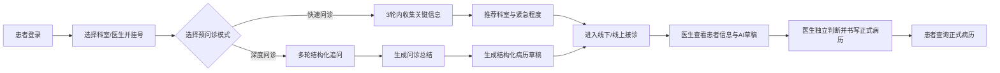
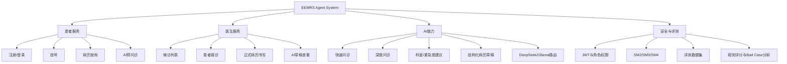
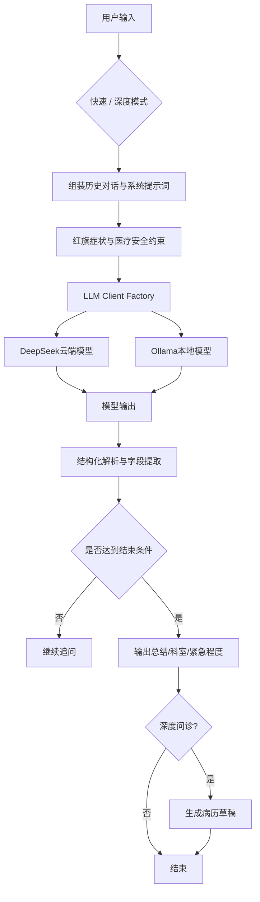
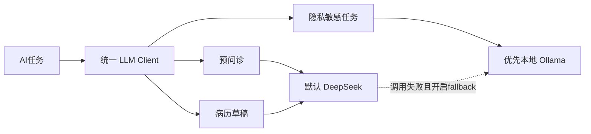
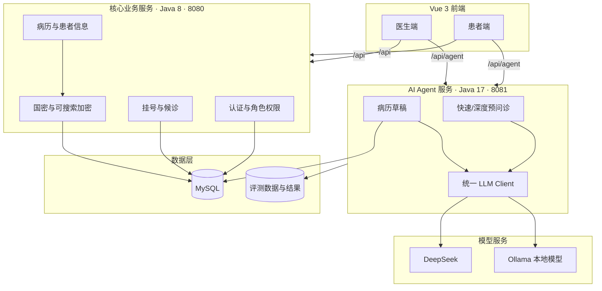
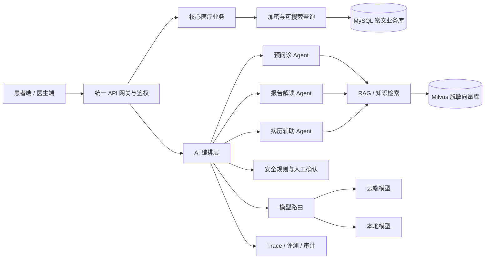
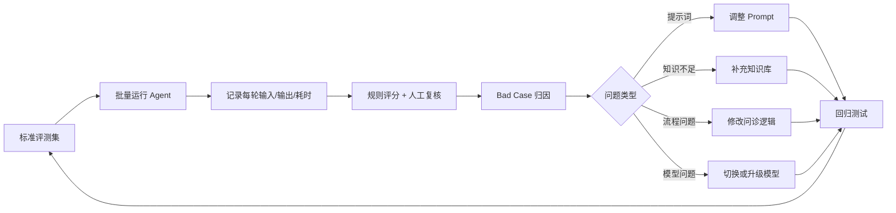

# EEMRS Agent System

> **面向患者与医生的安全可控 AI 辅助诊疗系统**  
> 在保留原有加密电子医疗业务的基础上，引入 AI 预问诊、病历草稿生成与智能体评测能力，形成“患者就诊前信息采集—医生接诊辅助—正式病历管理”的产品闭环。

<p align="center">
  
  
  
  
  
  
</p>

---

## 1. 项目一句话介绍

EEMRS Agent System 是一个由传统加密电子医疗系统升级而来的 **AI 辅助诊疗 MVP**：

- 患者可以完成注册、登录、挂号、病历查询和 AI 预问诊；
- AI 可以通过快速/深度问诊收集信息，并在深度问诊后生成结构化病历草稿；
- 医生可以查看候诊患者、接诊、书写正式病历，并只读查看患者的 AI 病历草稿；
- 系统支持 DeepSeek 云端模型与 Ollama 本地模型，并通过评测集持续发现问题和迭代效果。

> [!IMPORTANT]
> 本项目中的 AI 仅用于就诊前信息整理和医生辅助，不替代医生诊断、处方和正式病历签署。

---

## 2. 为什么要做这个产品

| 角色 | 原有问题 | 产品方案 | 预期价值 |
|---|---|---|---|
| 患者 | 不知道挂什么科；到院后仍需重复描述症状 | 快速/深度 AI 预问诊，输出科室建议和就诊摘要 | 降低表达成本，提高就诊准备度 |
| 医生 | 接诊前缺少结构化信息；病历书写存在重复劳动 | 展示预问诊摘要与结构化病历草稿 | 缩短信息整理时间，把精力用于判断和沟通 |
| 系统 | 传统 JavaFX + Socket 架构扩展困难 | Vue 前端 + REST 后端 + 独立 Agent 服务 | 降低迭代成本，便于接入更多 AI 能力 |
| 医疗数据 | 病历数据敏感，不能无边界地交给模型 | 国密存储、最小必要数据、云端/本地模型路由 | 在效率与隐私之间取得平衡 |

---

## 3. 产品用户与核心场景

### 3.1 患者端

- 注册、登录与个人信息维护
- 按科室和医生完成挂号
- 查询历史病历或报告
- 选择快速问诊或深度问诊
- 查看 AI 的追问、总结、推荐科室和紧急程度
- 深度问诊结束后生成预问诊病历草稿

### 3.2 医生端

- 查看候诊列表并接诊患者
- 查询患者信息和既往病历
- 查看患者最新的深度预问诊草稿
- 书写并提交正式病历

### 3.3 产品与研发人员

- 通过统一 LLM Client 切换 DeepSeek/Ollama
- 通过评测集、运行日志和 bad case 定位模型问题
- 逐步补齐报告解读、RAG、医生审核和安全审计能力

---

## 4. 核心用户旅程



> 当前版本中，医生端对 AI 草稿为**只读查看**；编辑、采纳、驳回和一键回填正式病历属于下一阶段能力。

---

## 5. 产品能力地图



---

## 6. 当前功能完成情况

图例：✅ 已实现　🟡 已有基础但需要完善　⏳ 规划中

| 产品模块 | 状态 | 当前说明 |
|---|:---:|---|
| 患者注册、登录、挂号 | ✅ | 由核心 Java 后端承载 |
| 医生候诊、接诊、正式病历 | ✅ | 已形成基础业务链路 |
| Vue 患者端与医生端 | ✅ | 已完成主要页面和路由改造 |
| 快速预问诊 | ✅ | 面向快速分诊，限制轮次并给出科室建议 |
| 深度预问诊 | ✅ | 多轮收集症状、病程和风险信息 |
| 结构化病历草稿 | ✅ | 仅在深度问诊结束后生成并独立存储 |
| 医生查看 AI 草稿 | ✅ | 当前为只读，不自动写入正式病历 |
| DeepSeek/Ollama 模型切换 | ✅ | 统一 LLM Client，支持按用途路由和可选 fallback |
| Agent 评测数据与脚本 | 🟡 | 已有规则评测与样例集，医学语义仍需人工复核 |
| Agent 服务统一鉴权 | 🟡 | 核心后端已有 JWT，Agent 服务仍需进一步统一权限边界 |
| AI 草稿加密与脱敏 | 🟡 | 原系统有国密能力，新增 AI 数据链路仍需统一接入 |
| 医生编辑/采纳/驳回草稿 | ⏳ | 下一阶段关键闭环 |
| 报告预解读 | ⏳ | 已有目标设计，尚未形成完整功能 |
| Milvus / RAG | ⏳ | 已列入目标架构，当前版本未形成完整知识检索链路 |
| 监控、审计与生产部署 | ⏳ | 需要补齐日志、告警、容器化和合规策略 |

---

## 7. AI 预问诊产品逻辑

### 7.1 两种问诊模式

| 模式 | 适用场景 | 产品目标 | 输出 |
|---|---|---|---|
| 快速问诊 | 症状明确、希望快速判断科室 | 在较少轮次内收集核心信息 | 推荐科室、紧急程度、简要建议 |
| 深度问诊 | 症状复杂、信息不完整 | 按病史结构逐步补齐信息 | 问诊总结、科室建议、紧急程度、病历草稿 |

### 7.2 Agent 处理流程



### 7.3 模型路由策略



该设计把业务逻辑与具体模型解耦，便于后续进行：

- 模型效果对比；
- 成本与延迟控制；
- 隐私任务本地化；
- 模型故障降级；
- A/B 测试和版本回归。

---

## 8. 系统架构

### 8.1 当前架构



### 8.2 目标架构演进



---

## 9. 仓库结构

```text
.
├── frontend-vue/              # Vue 3 患者端与医生端
├── eemrs-server-master/       # Java 8 核心业务后端
├── agent-server/              # Java 17 AI Agent 服务
├── evaluation/                # 预问诊评测数据、脚本与结果
├── Patient-master/            # 原 JavaFX 患者端（历史兼容）
├── Doctor-master/             # 原 JavaFX 医生端（历史兼容）
├── gmhelper-master/           # SM2/SM3/SM4 等国密工具
├── 电子医疗系统架构升级设计.md
└── *_REPORT.md                # 各阶段实现和验收记录
```

| 目录 | 产品定位 | 是否建议继续投入 |
|---|---|:---:|
| `frontend-vue` | 对外用户体验层 | 是 |
| `eemrs-server-master` | 权威业务和正式病历层 | 是 |
| `agent-server` | AI 能力与模型编排层 | 是 |
| `evaluation` | AI 质量保障层 | 是，优先增强 |
| `Patient-master` / `Doctor-master` | 旧客户端和迁移参考 | 仅兼容维护 |
| `gmhelper-master` | 数据安全基础能力 | 是 |

---

## 10. 数据安全与医疗边界

### 10.1 数据流原则


### 10.2 产品安全原则

1. **AI 不直接作出最终诊断**：输出定位为信息整理和辅助建议。
2. **高风险症状优先提醒就医**：红旗症状应具有规则兜底，不能只依赖大模型。
3. **正式病历必须由医生确认**：AI 草稿和正式病历严格区分。
4. **最小必要数据原则**：模型只获得完成当前任务所需的信息。
5. **云端与本地模型分级路由**：敏感数据优先使用本地模型。
6. **关键操作可审计**：记录模型版本、提示词版本、输入摘要、输出和人工修改。
7. **患者与医生权限隔离**：不能仅依赖前端路由，需要服务端强校验。

---

## 11. AI 质量评测闭环



### 11.1 建议重点指标

| 指标层级 | 指标 | 说明 |
|---|---|---|
| 北极星指标 | 有效预问诊完成率 | 用户完成问诊且医生认为信息可用的比例 |
| 信息质量 | 必问项覆盖率 | 主诉、病程、严重程度、伴随症状、过敏史等是否收集完整 |
| 分诊效果 | 科室推荐采纳率 | 推荐科室与医生/标准答案的一致程度 |
| 医疗安全 | 红旗症状召回率 | 对高危表现是否能稳定识别并提醒就医 |
| 医生效率 | 草稿采纳率、平均修改率 | AI 草稿是否真正减少医生整理工作 |
| 用户体验 | 完成时长、平均轮次、中途退出率 | 问诊是否过长、是否让用户困惑 |
| 模型体验 | 首字延迟、总响应时间、失败率 | 是否满足交互可用性 |
| 成本 | 单次问诊 Token/调用成本 | 云端模型成本是否可控 |
| 稳定性 | 回归通过率 | Prompt、模型或知识库更新后是否引入新问题 |

---

## 12. 产品完备度判断

> 以下判断基于最新开发分支的代码与阶段文档静态分析，不等同于医院生产环境验收。

| 维度 | 当前阶段 | 说明 |
|---|---|---|
| 基础医疗业务 | **可演示 MVP** | 注册、挂号、候诊、接诊、病历链路基本存在 |
| AI 预问诊 | **RAG 增强 MVP** | 快速/深度模式、知识检索、QuestionPlan 和 Must-Ask 已形成 |
| 医疗知识库 | **已接入主流程** | Milvus 入库与检索已完成，覆盖五类预问诊知识 |
| 医生协作闭环 | **部分完成** | 能查看草稿，但缺少编辑、采纳、驳回和回填 |
| AI 评测 | **基础闭环已建立** | 有 RAG A/B、Trace、规则评测和 bad case 复盘，需继续工程化 |
| 数据安全 | **基础能力较强，AI 链路待补齐** | 原系统有国密能力，Agent 鉴权、草稿加密、脱敏和审计仍需统一 |
| 报告智能分析 | **MVP/整合阶段** | 已有纵向分析思路与基础能力，尚未形成完整临床业务闭环 |
| 工程部署 | **开发环境阶段** | 需补 Docker Compose、CI/CD、监控、灰度和配置中心 |

**总体定位：一个具备真实医疗业务、Milvus RAG、结构化问诊规划和评测 Harness 的医疗 AI 全栈 MVP。**

---

## 13. 产品路线图

### P0：先完成安全可控的医生审核闭环

- Agent 服务接入统一 JWT 和角色权限；
- 校验患者数据归属和医生接诊关系；
- AI 草稿接入加密、脱敏和审计；
- 医生支持编辑、采纳、驳回草稿；
- AI 草稿经医生确认后再回填正式病历；
- 建立红旗症状规则兜底和高风险拦截。

**验收标准：** 未授权用户无法访问其他患者数据；所有正式病历均由医生确认；高风险测试集不能出现阻断级错误。

### P1：提升 AI 的专业性和可解释性

- 接入 Milvus 和医疗知识库；
- 建立带来源引用的 RAG；
- 上线检验报告结构化解析与纵向趋势分析；
- 对科室推荐、紧急程度和病历字段使用严格 Schema；
- 引入医生修改反馈，构建真实 bad case 数据集。

**验收标准：** AI 输出具备可追溯证据；必问项覆盖率、科室推荐准确率和医生草稿采纳率持续提升。

### P2：形成可持续运营的 AI 产品体系

- 建立 Trace、指标看板、成本监控和告警；
- 支持 Prompt、模型、知识库的版本管理；
- 建立离线评测 + 小流量灰度 + 在线反馈闭环；
- 完成 Docker Compose、CI/CD 和环境隔离；
- 增加多租户、权限审计和数据生命周期管理。

**验收标准：** 每次模型或 Prompt 变更均可回归、可灰度、可回滚，质量与成本可量化。

---

## 14. 本地启动示例

### 14.1 环境准备

- JDK 8：运行核心业务后端
- JDK 17：运行 AI Agent 服务
- Maven
- Node.js 与 npm
- MySQL 8
- DeepSeek API Key，或本地 Ollama 模型

### 14.2 启动核心业务后端

```bash
cd eemrs-server-master
mvn spring-boot:run
```

默认业务服务端口：`8080`

### 14.3 启动 AI Agent 服务

使用 DeepSeek：

```bash
# Linux / macOS
export DEEPSEEK_API_KEY="your-api-key"

# Windows PowerShell
$env:DEEPSEEK_API_KEY="your-api-key"

cd agent-server
mvn spring-boot:run
```

默认 Agent 服务端口：`8081`

使用本地 Ollama 时，可通过环境变量切换模型 provider，并确认 Ollama 服务已启动。

### 14.4 启动前端

```bash
cd frontend-vue
npm install
npm run dev
```

前端开发服务器会将普通业务请求代理到核心后端，将 `/api/agent` 请求代理到 AI Agent 服务。

> 具体数据库配置、模型配置和测试账号请参考各模块 README、`application.yml` 与仓库内运行说明。

---

## 15. 从 AI 产品经理角度看，项目的核心亮点

1. **不是孤立的聊天机器人**：AI 被嵌入挂号、预问诊、接诊和病历流程。
2. **采用渐进式系统升级**：保留原有业务和加密能力，新增 Vue 与独立 Agent 服务，降低改造风险。
3. **兼顾云端效果与本地隐私**：通过统一模型抽象层支持 DeepSeek/Ollama 路由和降级。
4. **明确 AI 与医生的责任边界**：草稿不是正式病历，最终判断与签署权归医生。
5. **具备评测和迭代意识**：通过评测集、规则评分和 bad case 形成 AI 产品迭代闭环。

---

## 16. 项目边界与免责声明

- 本项目当前定位为学习、科研和产品原型，不建议直接用于真实临床诊疗；
- AI 输出不构成诊断、处方或医疗决策；
- 在接入真实患者数据前，必须完成权限、脱敏、加密、审计、数据授权和合规评估；
- 云端模型的使用需遵循模型供应商条款和所在地区的医疗数据保护要求。

---

## 17. 后续建议补充的展示素材

为了让 GitHub 首页更直观，建议在 `docs/images/` 中补充以下截图，并在本文档顶部展示：

1. 患者端首页；
2. 快速/深度预问诊页面；
3. AI 问诊完成总结；
4. 医生端候诊列表；
5. 医生查看病历草稿页面；
6. 智能体评测结果看板；
7. 一段 1～2 分钟的完整业务演示 GIF。

---

<p align="center">
  <b>EEMRS Agent System</b><br/>
  让 AI 负责信息整理，让医生保留最终判断。
</p>
