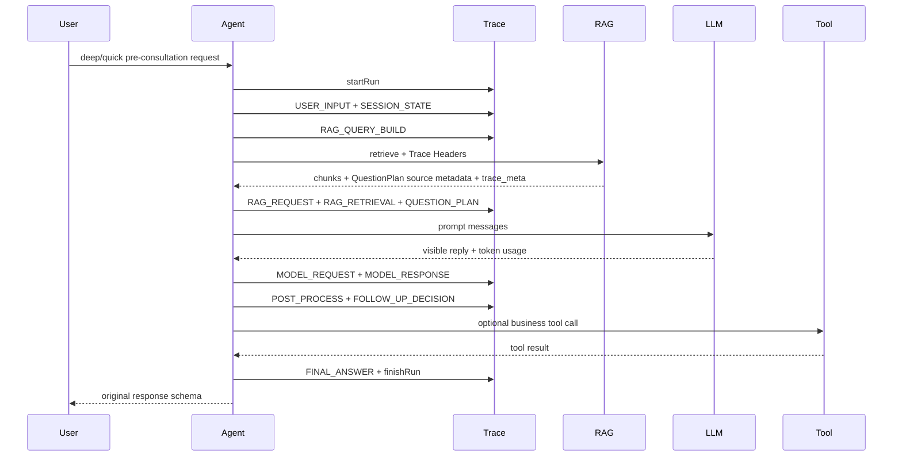

# Agent Trace Harness

## Why

The pre-consultation agent now calls RAG, builds a QuestionPlan, calls an LLM, post-processes the reply, and may later call business tools such as appointment booking. Ordinary logs make it hard to answer why a department was recommended, which RAG chunks were used, or where latency/errors happened. The trace harness records one queryable run per agent request without changing the existing business response JSON.

## Scope

Implemented in `agent-server` because it already owns the complete pre-consultation orchestration and has JDBC access to the same MySQL database. The EEMRS business backend and Python RAG service only receive/return trace headers or metadata; they do not duplicate table writes.

Not implemented in this phase: frontend trace UI, trace grading, automated alerts, OpenTelemetry export, scheduled trace cleanup, vertical report analysis, or new medical business logic.

## Architecture



## Tables

`agent_run` is the root row keyed by `run_id`. It stores status, trace/session/user hash, model/RAG/prompt versions, total latency, token totals, final output summary, and redacted error metadata.

`agent_step` stores ordered steps keyed by `step_id`, with `(run_id, sequence_no)` preserving the execution order. JSON fields are `LONGTEXT` for MySQL compatibility.

`tool_call` stores future appointment/business tool calls keyed by `tool_call_id`, including target service, endpoint, HTTP status, retry count, latency, request/response summaries, and redacted payloads when payload recording is enabled.

SQL lives at `agent-server/src/main/resources/sql/agent_trace_schema.sql`. `AgentTraceSchemaInitializer` also creates the same tables best-effort at app startup.

## Lifecycle

A run starts in `PreConsultationService.ask()`. Steps are recorded with explicit success/failure calls. Closing a run or step without success marks it failed so exceptions are not falsely recorded as success. Trace persistence errors are caught inside `EnabledTraceRecorder` and logged as `TRACE_PERSIST_FAILED`; the pre-consultation response continues.

Current connected step types are:

- `USER_INPUT`
- `SESSION_STATE`
- `RAG_QUERY_BUILD`
- `RAG_REQUEST`
- `RAG_RETRIEVAL`
- `QUESTION_PLAN`
- `MODEL_REQUEST`
- `MODEL_RESPONSE`
- `POST_PROCESS`
- `FOLLOW_UP_DECISION`
- `FINAL_ANSWER`

`TOOL_CALL` is implemented as a reusable framework and unit-tested with a mock tool lifecycle. Existing appointment flow is not changed in this phase.

## Trace ID Propagation

Headers are centralized in `TraceHeaders`:

- `X-Agent-Trace-Id`
- `X-Agent-Run-Id`
- `X-Agent-Step-Id`
- `X-Agent-Session-Id`

`TraceRequestFilter` reads inbound IDs, creates missing `trace_id`/`run_id`, writes MDC keys, and returns trace/run IDs in HTTP response headers. `RagRetrievalClient` forwards the headers to FastAPI RAG. `rag_api_server.py` reads the headers, echoes them, and adds a backward-compatible `trace_meta` object.

## Privacy

By default the harness stores summaries, hashes, counts, IDs of RAG chunks, doc types, scores, token usage, latency, and structured decision metadata. Full patient input, full prompt, full RAG text, API keys, Authorization headers, cookies, passwords, patient IDs, doctor IDs, mobile numbers, ID cards, and emails are redacted or omitted. Full payload capture is disabled by default with `agent.trace.payload-enabled=false`.

User identifiers are stored only as `user_id_hash`, generated with SHA-256 plus `agent.trace.user-hash-salt`. The committed default salt is empty; production must provide it through `AGENT_TRACE_HASH_SALT`.

The harness does not store hidden chain-of-thought. It stores only visible replies, structured QuestionPlan/RAG metadata, and business decision summaries.

## Configuration

```yaml
agent:
  trace:
    enabled: true
    persistence-enabled: true
    payload-enabled: false
    payload-max-length: 4000
    summary-max-length: 1000
    async-enabled: true
    retention-days: 30
    user-hash-salt: ${AGENT_TRACE_HASH_SALT:}
    cost:
      enabled: false
      currency: CNY
      config-version: v1
      models: {}
```

When `enabled=false`, `NoopTraceRecorder` is used. When persistence is unavailable, trace failures are logged and swallowed. Cost calculation is reserved; if prices are not configured, token counts are recorded and cost remains null.

## Query API

- `GET /api/agent-traces/runs`
- `GET /api/agent-traces/runs/{runId}`
- `GET /api/agent-traces/runs/{runId}/steps`
- `GET /api/agent-traces/runs/{runId}/tool-calls`
- `GET /api/agent-traces/runs/{runId}/detail`

The API is read-only and intended for developer/admin troubleshooting. This agent-server currently has no dedicated role system, so network/API gateway restrictions should protect it before production exposure.

## Testing

Java:

```bash
cd agent-server
mvn test
```

Covers TraceContext/MDC cleanup, request isolation, redaction, payload truncation, run/step/tool lifecycle, token totals, latency, sequence order, Noop behavior, persistence failure isolation, and RAG header propagation.

Python:

```bash
pytest rag/test_rag_trace_meta.py
```

Covers trace metadata construction and backward-compatible optional `trace_meta`.

## Example Detail

```json
{
  "run": {
    "run_id": "run-example",
    "session_id": "session-001",
    "agent_name": "deep-preconsultation-agent",
    "status": "SUCCESS",
    "model_name": "deepseek-v4-flash",
    "prompt_version": "preconsultation-deep-v1",
    "rag_version": "medical-rag-v1",
    "total_latency_ms": 1820,
    "prompt_tokens": 1500,
    "completion_tokens": 320,
    "total_tokens": 1820
  },
  "steps": [
    {"sequence_no": 1, "step_type": "USER_INPUT", "status": "SUCCESS"},
    {"sequence_no": 2, "step_type": "SESSION_STATE", "status": "SUCCESS"},
    {"sequence_no": 3, "step_type": "RAG_QUERY_BUILD", "status": "SUCCESS"},
    {"sequence_no": 4, "step_type": "RAG_REQUEST", "status": "SUCCESS"},
    {"sequence_no": 5, "step_type": "RAG_RETRIEVAL", "status": "SUCCESS"},
    {"sequence_no": 6, "step_type": "QUESTION_PLAN", "status": "SUCCESS"},
    {"sequence_no": 7, "step_type": "MODEL_REQUEST", "status": "SUCCESS"},
    {"sequence_no": 8, "step_type": "MODEL_RESPONSE", "status": "SUCCESS", "total_tokens": 1820},
    {"sequence_no": 9, "step_type": "POST_PROCESS", "status": "SUCCESS"},
    {"sequence_no": 10, "step_type": "FOLLOW_UP_DECISION", "status": "SUCCESS"},
    {"sequence_no": 11, "step_type": "FINAL_ANSWER", "status": "SUCCESS"}
  ],
  "tool_calls": []
}
```

## Future Extension

Trace grading can consume `agent_run` and `agent_step` rows later without changing the live pre-consultation path. OpenTelemetry can also be added later by mapping `run_id`/`step_id` to spans, but this phase deliberately avoids adding new observability infrastructure.
