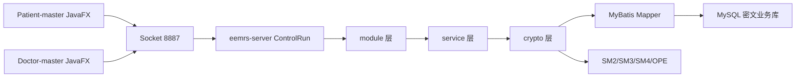
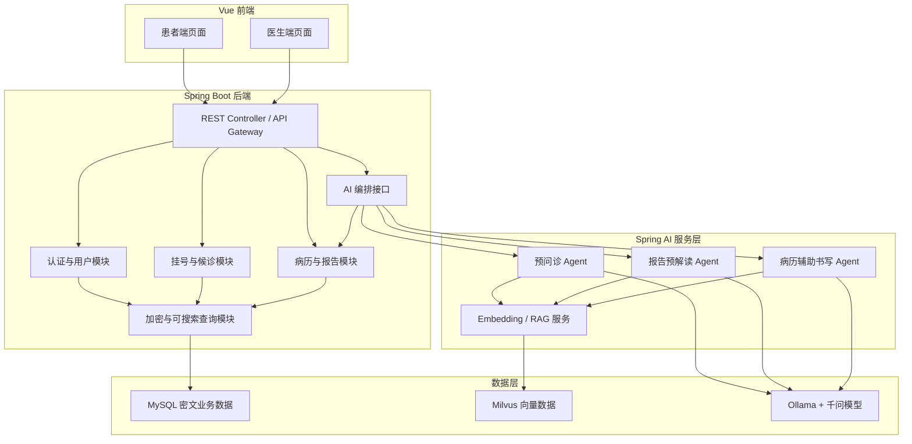
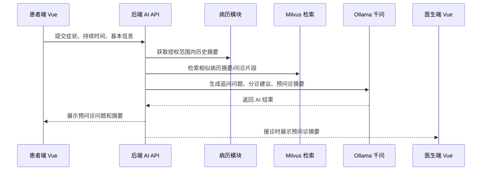

# 电子医疗系统架构升级设计方案

## 1. 文档目标

本文档根据 `main.md` 的改造要求，结合当前代码结构，对现有电子医疗系统进行架构分析，并给出在“尽量保留后端核心业务逻辑”的前提下，升级为“底层可搜索加密数据库 + 上层 AI 智能问诊”的前后端分离方案。

本阶段只做系统分析和改造方案设计，不编写具体业务代码。

## 2. 现有系统概览

### 2.1 当前项目组成

| 项目目录 | 当前定位 | 技术形态 | 主要职责 |
| --- | --- | --- | --- |
| `eemrs-server-master` | 服务端 | Java 8、Spring Boot 2.1.8、MyBatis、Socket | 用户登录注册、挂号、病历写入、病历查询、加密存储、密钥协商 |
| `Patient-master` | 患者端 | JavaFX 客户端、Socket | 患者登录注册、挂号、报告查询、个人信息维护 |
| `Doctor-master` | 医生端 | JavaFX 客户端、Socket | 医生登录、接诊、写病历、查询病历、修改密码 |
| `gmhelper-master` | 国密辅助库 | Java、Bouncy Castle | SM2、SM3、SM4、证书与国密工具能力 |

说明：`main.md` 中写到患者端和医生端是 Java Web，但从代码看二者实际是 JavaFX 桌面客户端，使用 FXML 页面和 Socket 与服务端通信。

### 2.2 当前核心链路



### 2.3 当前服务端分层

| 层级 | 代表代码 | 当前作用 | 改造判断 |
| --- | --- | --- | --- |
| 通信入口 | `EemrsServerApplication`、`ControlRun`、`BuildSession` | 启动 Socket 服务、维护会话密钥、按 opcode 分发请求 | 需要改造为 REST API，Socket 可短期保留为兼容层 |
| 业务编排 | `module/userop`、`module/guahao`、`module/dataOp` | 将请求转为业务调用并包装响应 | 可复用部分逻辑，但建议逐步并入 REST Service/Application Service |
| 服务层 | `UserOpService`、`GuahaoService`、`DataOpService`、`PatientInfoService` | 暴露用户、挂号、病历、患者信息操作 | 重点保留 |
| 加密处理层 | `crypto/*`、`JavaBeanEnc`、`SMServerKey`、`BoldyrevaCipher` | SM4 密文存储、SM3 哈希索引、OPE 可搜索范围查询、SM2 签名校验 | 重点保留并封装 |
| 持久化层 | `mapper/*`、`mybatis/mapper/*.xml` | MyBatis 访问 MySQL | 重点保留，补充新表 |
| 客户端 UI | `PatientControllers`、`DoctorControllers`、FXML | JavaFX 页面和事件处理 | 需要用 Vue 重写 |
| 客户端通信 | `ConnectionWithServer`、`TransDataWithServer` | Socket 握手、SM4 会话加密、opcode 请求 | 需要替换为 HTTP API 调用 |

## 3. 现有功能与 opcode 边界

| opcode | 当前功能 | 使用端 | 建议 REST 接口方向 |
| --- | --- | --- | --- |
| `13` | 登录 | 患者端、医生端 | `POST /api/auth/login` |
| `14` | 注册 | 患者端、医生端 | `POST /api/auth/register` |
| `15` | 注销用户 | 患者端、医生端 | `DELETE /api/users/me` 或后台管理接口 |
| `18` | 修改密码 | 患者端、医生端 | `PUT /api/users/password` |
| `19` | 修改患者信息 | 患者端 | `PUT /api/patients/me` |
| `5` | 根据科室获取医生 | 患者端 | `GET /api/doctors?department=...` |
| `31` | 患者挂号 | 患者端 | `POST /api/appointments` |
| `32` | 查询候诊列表 | 医生端 | `GET /api/doctors/me/waiting-list` |
| `33` | 接诊患者 | 医生端 | `POST /api/appointments/{id}/accept` |
| `12` | 写入病历 | 医生端 | `POST /api/medical-records` |
| `11` | 查询病历/报告 | 患者端、医生端 | `GET /api/medical-records` |
| `1` | 获取患者信息 | 医生端 | `GET /api/patients/{id}` |
| `3` | 获取医生信息 | 医生端 | `GET /api/doctors/me` |

## 4. 目标架构设计

### 4.1 总体目标

目标系统拆分为：

1. 前端：Vue 单页应用，区分患者端和医生端视图。
2. 核心业务后端：Spring Boot REST API，保留现有业务、加密、MyBatis 核心逻辑。
3. AI 服务层：Spring AI，调用本地 Ollama 千问模型。
4. 密文业务数据库：MySQL，继续存储加密后的患者、医生、挂号、病历数据。
5. 向量数据库：Milvus，存储病历摘要、报告片段、问诊内容等向量索引。



### 4.2 架构原则

| 原则 | 说明 |
| --- | --- |
| 后端核心逻辑优先复用 | 保留 `service`、`crypto`、`mapper`、加密实体转换逻辑，降低重写风险 |
| 先适配，后重构 | 先用 REST Controller 包装现有 Service，再逐步拆掉 Socket 和 opcode |
| 密文业务库不裸存敏感信息 | 继续使用 SM4 密文、SM3 哈希索引、OPE 范围查询能力 |
| AI 不直接访问明文数据库 | AI 通过受控业务接口获取最小必要上下文，输出建议需医生确认 |
| 向量库只存可控内容 | Milvus 存脱敏摘要、结构化片段、向量和业务引用 ID，不作为权威业务库 |
| 医疗安全优先 | AI 输出定位为辅助建议，不能直接替代医生诊断和病历签署 |

## 5. 保留不动、复用和改造范围

### 5.1 保留不动的部分

| 模块 | 代码位置 | 保留原因 |
| --- | --- | --- |
| 国密基础能力 | `gmhelper-master/src/main/java/org/zz/gmhelper` | 已提供 SM2、SM3、SM4 等底层工具 |
| SM2/SM3/SM4 工具封装 | `eemrs-server-master/src/main/java/com/liu/eemrsserver/utils/crypto` | 服务端密文处理依赖这些工具 |
| OPE 可搜索加密算法 | `utils/crypto/homomorphic/boldyreva` | 当前范围查询依赖该能力 |
| 密钥读取与配置 | `SMServerKey`、`MyConfig#smServerKey` | 可继续作为服务端密钥配置入口 |
| MyBatis Mapper SQL 主体 | `mapper/*`、`resources/mybatis/mapper/*.xml` | 已承载密文表操作，可作为数据访问基础 |
| 领域对象 | `domain/*`、`jsontrans/*` | 可继续作为 DTO/DO 基础，后续再规范命名 |

### 5.2 可复用但需要轻度改造的部分

| 模块 | 当前问题 | 改造方式 |
| --- | --- | --- |
| `UserOpService` | 面向 Socket 请求间接调用，认证状态在长连接线程中维护 | 改为 REST 登录，返回 Token；保留用户校验和密文查询逻辑 |
| `GuahaoService` | 业务功能清晰，但接口命名和删除逻辑需整理 | 包装为预约/挂号 API，补充预约状态字段 |
| `DataOpService` | 已支持病历插入和条件查询 | 包装为病历 API，补充分页、权限过滤、AI 摘要字段 |
| `PatientInfoService` | 患者信息修改可复用 | 包装为患者资料 API，补充当前用户身份校验 |
| `crypto/*` | 既做加密又直接查 Mapper，职责偏重 | 保留算法和密文转换，逐步拆为 `CryptoService` 与 `EncryptedRepository` |
| `JavaBeanEnc` | 负责多个对象的加解密转换 | 保留函数，后续按领域拆分为 `PatientCryptoMapper`、`RecordCryptoMapper` |

### 5.3 需要重点改造的部分

| 模块 | 当前问题 | 目标形态 |
| --- | --- | --- |
| Socket 通信入口 | `ServerSocket:8887`、`ControlRun`、opcode 分发不适合 Web 前后端分离 | 新增 REST Controller，使用 HTTP/JSON |
| 会话管理 | 当前依赖 Socket 会话密钥和 `isLog` 线程状态 | 改为 Spring Security + JWT/Session |
| JavaFX 客户端 | FXML 和 Controller 与 Socket 强耦合 | 用 Vue 重写患者端和医生端 |
| 客户端国密通信 | 每个客户端维护 SM2/SM4 握手 | Web 场景优先使用 HTTPS，必要时在请求体字段级做国密加密 |
| opcode 响应码 | `codeMap` 难维护 | 改为 HTTP 状态码 + 统一响应结构 |
| 日志与异常 | 日志乱码、异常处理分散 | 统一异常处理、结构化日志、审计日志 |

### 5.4 需要新增的部分

| 新增模块 | 作用 |
| --- | --- |
| `controller` REST 接口层 | 对 Vue 前端提供 HTTP API |
| `security` 认证授权层 | 登录、Token、角色、接口权限 |
| `ai` Spring AI 编排层 | 预问诊、报告预解读、病历辅助书写 |
| `vector` Milvus 向量检索层 | 文本切片、Embedding、向量写入和检索 |
| `dto` 请求响应对象 | 解耦前端请求、后端领域对象和数据库实体 |
| `audit` 审计模块 | 记录敏感查询、AI 调用、病历访问、医生确认 |
| `frontend-vue` | 患者端和医生端新前端 |
| `migration` 数据迁移脚本 | 兼容旧表，新增 AI 和向量索引相关表 |

## 6. 前后端分离后的模块划分

### 6.1 后端模块划分

| 模块 | 子模块 | 主要职责 |
| --- | --- | --- |
| 用户认证模块 | `auth`、`user` | 登录、注册、修改密码、角色识别、Token 发放 |
| 患者模块 | `patient` | 患者资料维护、患者首页、患者报告查看 |
| 医生模块 | `doctor` | 医生资料、科室医生列表、医生工作台 |
| 挂号模块 | `appointment` | 科室医生查询、挂号、候诊列表、接诊、取消挂号 |
| 病历模块 | `medical-record` | 病历新增、条件查询、报告查看、医生签名校验 |
| 加密模块 | `crypto` | SM2/SM3/SM4/OPE、字段加解密、哈希索引生成 |
| AI 模块 | `ai` | Spring AI 调用、Prompt 模板、Agent 编排、AI 结果落库 |
| 向量模块 | `vector` | Milvus Collection、Embedding、RAG 检索 |
| 审计模块 | `audit` | 操作日志、访问记录、AI 调用记录 |

### 6.2 前端模块划分

| 前端模块 | 页面/功能 | 对应后端 |
| --- | --- | --- |
| 登录注册 | 患者/医生登录、注册 | `auth` |
| 患者工作台 | 预约挂号、报告查询、个人资料 | `patient`、`appointment`、`medical-record` |
| 患者 AI 助手 | 预问诊、报告预解读 | `ai` |
| 医生工作台 | 候诊列表、接诊、病历书写、历史病历查询 | `doctor`、`appointment`、`medical-record` |
| 医生 AI 助手 | 病历草稿、诊疗摘要、结构化建议 | `ai` |
| 公共组件 | 表单、搜索条件、结果表格、审计提示 | 公共 API |

## 7. 接口边界设计

### 7.1 患者端接口边界

| 业务场景 | API | 输入 | 输出 | 说明 |
| --- | --- | --- | --- | --- |
| 患者登录 | `POST /api/auth/login` | 身份证号、密码、类型 `patient` | Token、用户基本信息 | 替代 opcode `13` |
| 患者注册 | `POST /api/auth/register` | 患者注册信息 | 注册结果 | 替代 opcode `14` |
| 修改密码 | `PUT /api/users/password` | 旧密码、新密码 | 操作结果 | 替代 opcode `18` |
| 修改个人资料 | `PUT /api/patients/me` | 患者资料 | 操作结果 | 替代 opcode `19` |
| 查询科室医生 | `GET /api/doctors?department=...` | 科室 | 医生列表 | 替代 opcode `5` |
| 挂号 | `POST /api/appointments` | 科室、医生 ID | 挂号结果 | 替代 opcode `31` |
| 查询报告 | `GET /api/medical-records` | 时间、科室、医生等条件 | 病历/报告列表 | 替代 opcode `11` |
| 预问诊 | `POST /api/ai/pre-consultations` | 症状、持续时间、基础信息 | 问诊问题、风险提示、摘要 | 新增 |
| 报告预解读 | `POST /api/ai/report-interpretations` | 报告 ID 或报告文本 | 通俗解读、注意事项、就医建议 | 新增 |

### 7.2 医生端接口边界

| 业务场景 | API | 输入 | 输出 | 说明 |
| --- | --- | --- | --- | --- |
| 医生登录 | `POST /api/auth/login` | 身份证号、密码、类型 `doctor` | Token、医生信息 | 替代 opcode `13` |
| 获取医生信息 | `GET /api/doctors/me` | Token | 医生资料 | 替代 opcode `3` |
| 候诊列表 | `GET /api/doctors/me/waiting-list` | 科室/医生身份 | 候诊患者列表 | 替代 opcode `32` |
| 接诊患者 | `POST /api/appointments/{id}/accept` | 预约 ID | 患者基础资料 | 替代 opcode `33`、`1` |
| 写病历 | `POST /api/medical-records` | 病情描述、用药、费用、签名等 | 写入结果 | 替代 opcode `12` |
| 查询病历 | `GET /api/medical-records` | 条件查询 | 病历列表 | 替代 opcode `11` |
| 病历辅助书写 | `POST /api/ai/record-drafts` | 预问诊摘要、医生输入、历史病历上下文 | 病历草稿和结构化建议 | 新增 |
| AI 建议确认 | `POST /api/ai/suggestions/{id}/confirm` | 采纳/修改/拒绝 | 审计结果 | 新增 |

### 7.3 AI 服务接口边界

| AI 能力 | API | 调用方 | 数据来源 | 输出去向 |
| --- | --- | --- | --- | --- |
| 患者预问诊 | `POST /api/ai/pre-consultations` | 患者端 | 患者输入、历史病历摘要、科室知识 | 返回患者端，并可生成接诊摘要 |
| 报告预解读 | `POST /api/ai/report-interpretations` | 患者端 | 病历/报告内容、医学解释模板 | 返回患者端，保存 AI 解读记录 |
| 病历辅助书写 | `POST /api/ai/record-drafts` | 医生端 | 预问诊摘要、当前接诊信息、历史病历检索结果 | 返回医生端草稿，医生确认后写入病历 |
| 向量入库 | `POST /api/vector/index/medical-records/{id}` | 后端内部 | 已确认病历、脱敏摘要 | 写入 Milvus |
| 相似病例检索 | `POST /api/vector/search` | AI 内部 | 查询文本、患者/科室过滤条件 | 返回相似片段给 AI 上下文 |

## 8. AI 智能体接入点设计

### 8.1 患者预问诊



嵌入业务流程的位置：

| 环节 | 设计 |
| --- | --- |
| 挂号前 | 患者填写症状，AI 生成建议科室和补充问题 |
| 挂号后 | 预问诊摘要绑定到预约记录 |
| 接诊时 | 医生打开候诊患者时看到 AI 摘要，但医生可忽略或修改 |
| 落库 | 保存预问诊原文、AI 摘要、版本、模型信息、患者确认状态 |

### 8.2 报告预解读

| 环节 | 设计 |
| --- | --- |
| 报告查询后 | 患者在报告详情页点击“AI 解读” |
| 上下文获取 | 后端通过病历 API 获取该报告内容，必要时检索同类医学说明模板 |
| AI 输出 | 用通俗语言解释指标、风险、注意事项，并明确“不能替代医生诊断” |
| 安全控制 | 不允许 AI 修改报告，不允许给出确定性诊断；输出保存到 AI 解释记录 |

### 8.3 医生病历辅助书写

| 环节 | 设计 |
| --- | --- |
| 接诊开始 | 医生查看患者预问诊摘要和历史病历摘要 |
| 书写中 | 医生输入主诉、现病史、检查结果，AI 生成结构化病历草稿 |
| 写入前 | 医生必须确认、编辑并签名 |
| 写入后 | 仍走现有 `DataOpService.insertInto` 和 `DataOpCrypto.insertInto`，保留 SM2 签名校验、SM4 密文存储和 SM3 哈希索引 |

## 9. MySQL 与 Milvus 数据设计建议

### 9.1 MySQL 保持为权威业务库

继续保留现有密文表：

| 表方向 | 当前用途 | 改造建议 |
| --- | --- | --- |
| 医生表 | 存医生密文信息、哈希索引 | 增加角色、状态、科室标准编码 |
| 患者表 | 存患者密文信息、哈希索引、病历计数器 | 增加资料完整度、授权标记 |
| 挂号表 | 存挂号和候诊信息 | 增加预约 ID、状态、AI 预问诊 ID |
| 病历表 | 存病历密文、医生签名、患者哈希索引 | 增加 AI 草稿来源、向量索引状态 |

新增建议表：

| 表名 | 作用 |
| --- | --- |
| `tb_ai_pre_consultation` | 预问诊会话、患者输入、AI 摘要、绑定预约 |
| `tb_ai_report_interpretation` | 报告预解读结果、模型版本、患者确认记录 |
| `tb_ai_record_draft` | 医生病历辅助草稿、采纳状态、医生最终修改 |
| `tb_vector_index_ref` | MySQL 业务记录与 Milvus 向量 ID 映射 |
| `tb_audit_log` | 敏感数据访问、AI 调用、医生确认审计 |

### 9.2 Milvus 只存向量与引用

| Collection | 存储内容 | 说明 |
| --- | --- | --- |
| `medical_record_chunks` | 脱敏病历摘要向量、科室、时间、业务 ID | 用于医生辅助书写和相似病历检索 |
| `report_chunks` | 报告摘要向量、报告类型、业务 ID | 用于报告解读 RAG |
| `pre_consultation_chunks` | 预问诊摘要向量、症状标签、预约 ID | 用于接诊前上下文 |
| `medical_knowledge_chunks` | 医学知识片段、来源、版本 | 用于通用解释和提示，不替代诊断 |

Milvus 中不要存身份证号、姓名、手机号、完整病历明文。需要关联时通过 `business_id` 回到 MySQL，由业务权限控制是否解密。

## 10. 分阶段实施路线图

| 阶段 | 目标 | 主要任务 | 验收标准 |
| --- | --- | --- | --- |
| 第 1 阶段：现有后端梳理 | 稳住核心逻辑 | 梳理 opcode 到业务接口映射；补充服务层单元测试；确认现有 MySQL 表结构 | 现有 Socket 业务可正常跑通，接口清单明确 |
| 第 2 阶段：REST 适配层 | 建立前后端分离入口 | 新增 Controller、统一响应、异常处理；REST 调用复用现有 Service | Postman/接口测试可完成登录、挂号、查询、写病历 |
| 第 3 阶段：认证与权限 | 替代 Socket 会话 | 引入 Spring Security/JWT；患者、医生角色隔离；接口鉴权 | 无 Token 不能访问业务接口，越权访问被拒绝 |
| 第 4 阶段：Vue 前端重写 | 替代 JavaFX | 建立 Vue 工程；实现患者端和医生端基础流程 | 患者可挂号查报告，医生可接诊写病历 |
| 第 5 阶段：AI 基础接入 | 接入 Spring AI + Ollama | 配置 Ollama 千问；新增 AI Controller；实现基础 Prompt 调用 | 能完成预问诊、报告解读、病历草稿的最小闭环 |
| 第 6 阶段：Milvus 与 RAG | 增强上下文检索 | 新增向量入库、Embedding、相似检索；绑定业务记录 | AI 能引用历史摘要和知识片段生成结果 |
| 第 7 阶段：安全审计与治理 | 医疗可控上线 | 增加 AI 输出审计、医生确认、敏感字段脱敏、日志追踪 | AI 输出可追溯，医生确认链路完整 |
| 第 8 阶段：移除旧通信 | 清理技术债 | 停用 Socket/opcode，归档 JavaFX 客户端 | 生产入口只保留 REST + Vue |

## 11. 建议项目目录结构

建议采用一个后端主工程 + 一个前端工程 + 保留国密工具库的结构：

```text
eemrs-upgrade/
├── backend/
│   ├── pom.xml
│   └── src/main/java/com/liu/eemrs/
│       ├── EemrsApplication.java
│       ├── common/
│       │   ├── ApiResponse.java
│       │   ├── GlobalExceptionHandler.java
│       │   └── PageResult.java
│       ├── security/
│       │   ├── JwtAuthenticationFilter.java
│       │   ├── SecurityConfig.java
│       │   └── CurrentUser.java
│       ├── auth/
│       │   ├── AuthController.java
│       │   ├── AuthService.java
│       │   └── dto/
│       ├── patient/
│       │   ├── PatientController.java
│       │   ├── PatientService.java
│       │   └── dto/
│       ├── doctor/
│       │   ├── DoctorController.java
│       │   ├── DoctorService.java
│       │   └── dto/
│       ├── appointment/
│       │   ├── AppointmentController.java
│       │   ├── AppointmentService.java
│       │   └── dto/
│       ├── medicalrecord/
│       │   ├── MedicalRecordController.java
│       │   ├── MedicalRecordService.java
│       │   └── dto/
│       ├── crypto/
│       │   ├── CryptoService.java
│       │   ├── FieldEncryptor.java
│       │   ├── SearchableEncryptor.java
│       │   └── legacy/
│       ├── ai/
│       │   ├── AiController.java
│       │   ├── PreConsultationAgent.java
│       │   ├── ReportInterpretationAgent.java
│       │   ├── RecordDraftAgent.java
│       │   ├── PromptTemplates.java
│       │   └── dto/
│       ├── vector/
│       │   ├── MilvusConfig.java
│       │   ├── VectorIndexService.java
│       │   └── EmbeddingService.java
│       ├── audit/
│       │   ├── AuditService.java
│       │   └── AuditLogMapper.java
│       ├── domain/
│       ├── mapper/
│       └── config/
│
├── frontend-vue/
│   ├── package.json
│   └── src/
│       ├── api/
│       │   ├── auth.ts
│       │   ├── patient.ts
│       │   ├── doctor.ts
│       │   ├── appointment.ts
│       │   ├── medicalRecord.ts
│       │   └── ai.ts
│       ├── views/
│       │   ├── auth/
│       │   ├── patient/
│       │   └── doctor/
│       ├── components/
│       ├── router/
│       ├── stores/
│       └── utils/
│
├── gmhelper-master/
│   └── 保留现有国密工具库
│
├── database/
│   ├── mysql/
│   │   ├── V1__legacy_schema.sql
│   │   ├── V2__ai_tables.sql
│   │   └── V3__audit_tables.sql
│   └── milvus/
│       └── collections.md
│
└── docs/
    ├── api-design.md
    ├── ai-design.md
    ├── crypto-design.md
    └── migration-plan.md
```

## 12. 推荐落地顺序

优先顺序如下：

1. 先不要动 `crypto`、`mapper` 和 MySQL 密文存储逻辑。
2. 先给现有 `UserOpService`、`GuahaoService`、`DataOpService` 外面包一层 REST Controller。
3. 用接口测试确认 REST 与原 Socket 结果一致。
4. 再重写 Vue 患者端和医生端，替换 JavaFX。
5. 核心业务稳定后，再接入 Spring AI、Ollama 和 Milvus。
6. AI 结果先只做“建议”和“草稿”，不直接写入正式病历。
7. 最后清理 Socket、opcode、JavaFX 客户端和重复 DTO。

## 13. 关键风险与控制措施

| 风险 | 表现 | 控制措施 |
| --- | --- | --- |
| 加密逻辑被破坏 | 旧密文无法查询或解密 | 保留原加密工具，先加测试，再重构 |
| REST 改造导致权限放大 | 患者查到他人病历 | 强制基于 Token 的用户身份过滤 |
| AI 输出医疗风险 | AI 给出确定诊断或错误建议 | Prompt 约束、医生确认、免责声明、审计记录 |
| Milvus 存储敏感明文 | 向量库泄露隐私 | 只存脱敏摘要和业务引用 ID |
| 新旧接口并行混乱 | Socket 与 REST 数据不一致 | 过渡期统一调用同一 Service，不复制业务逻辑 |
| Spring Boot 版本较旧 | 接入 Spring AI 可能受限 | 可新建升级分支，评估升级到 Spring Boot 3.x；若短期不能升级，则 AI 服务可独立成单独 Spring Boot 服务 |

## 14. 结论

当前系统的核心价值集中在服务端的密文业务处理能力：SM4 加密存储、SM3 哈希索引、OPE 范围查询、SM2 签名校验，以及围绕挂号、查询、写病历的 Service 和 Mapper。改造时应尽量保留这些核心逻辑，不应从数据库和加密层开始大改。

推荐路线是：先用 REST API 包装现有后端能力，完成前后端分离；再用 Vue 替换 JavaFX；最后在业务流程的安全接入点中引入 Spring AI、Ollama 千问模型和 Milvus 向量检索。这样能最大限度降低改造风险，同时满足“可搜索加密数据库 + AI 智能问诊”的目标架构。
